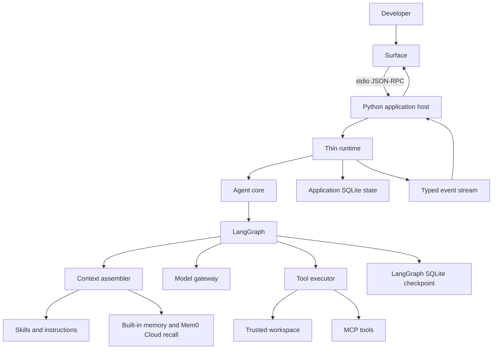

# Local-first Coding Agent Target Architecture

> Status: Accepted target
>
> Decision date: 2026-07-10
>
> Implementation status: Not yet complete. This document describes the
> architecture the repository is migrating toward; it does not describe every
> behavior of the current implementation.

## Product Definition

Awesome Agent is a single-user, local-first coding agent that helps a developer
understand, modify, and validate the code in one trusted workspace.

It is not a general agent platform, hosted multi-user service, distributed job
scheduler, workflow engine, or durable worker system. New abstractions must be
justified by a current coding-agent workflow rather than a hypothetical future
platform use case.

## First-principles Constraints

1. The workspace filesystem is the product's primary working state.
2. One local developer and one active interactive turn are the default case.
3. Python owns all product and agent behavior. TypeScript is allowed only for
   the Ink + React TUI.
4. LangGraph owns graph execution, graph state, checkpoints, streaming, and
   interrupts. Awesome Agent must not build a second graph runtime around it.
5. The runtime is a thin local lifecycle boundary, not an independent durable
   execution platform.
6. SQLite and ordinary files are sufficient for local product state.
7. Security boundaries must be enforced by code around tool execution, not by
   prompt wording.
8. Extension points stay narrow until at least two real implementations need a
   shared abstraction.
9. Current development data is disposable. The rewrite has no legacy data
   migration or compatibility requirement.

## Target Shape



The initial surface may be a minimal Python CLI. The product TUI is Ink +
React and contains rendering and input behavior only. A future API or IDE
plugin must reuse the same Python application host instead of reimplementing
the agent loop.

## Complete Turn Flow

```text
user input
  -> surface input parser
  -> application command or conversation turn
  -> thin runtime lifecycle
  -> LangGraph agent graph
  -> deterministic context assembly
  -> model gateway
  -> tool request
  -> tool policy and execution
  -> normalized observation
  -> graph state update and checkpoint
  -> typed event notification
  -> surface rendering
  -> final turn and change-set persistence
```

Slash commands and direct input forms such as `@path` and `!command` enter the
application boundary. They do not bypass workspace trust, tool policy, change
capture, or event emission.

## Responsibility Boundaries

| Module | Owns | Does not own |
| --- | --- | --- |
| Agent core | Reasoning loop, model/tool sequencing, context budget, loop invariants, final answer | UI rendering, distributed scheduling, storage adapters |
| LangGraph | Graph execution, graph state, checkpoint, stream, interrupt/resume | Product threads, workspace trust, tool permissions, UI state |
| Thin runtime | Session/turn lifecycle, single-turn serialization, cancellation, application command dispatch, event forwarding | Custom state machine, worker queue, leases, recovery engine |
| Context management | Deterministic prompt assembly, token budget, conversation tail, summaries, memory and skill context | Tool execution and provider routing |
| Model gateway | Provider-neutral messages, tool calls, streaming, usage, bounded retry semantics | Agent policy and graph control flow |
| Tool system | Registry, schema validation, workspace policy, execution, normalized results, change capture | Reasoning, skill selection, UI approval flows |
| Skills | Discoverable instruction packages and task workflows | Executable permissions, hidden tools, agent-loop control flow |
| Memory | Built-in files, Mem0 Cloud recall/write policy, redaction, scope | Conversation history, checkpoint replacement, system policy |
| Persistence | Small application records and LangGraph-owned checkpoints | Raw event sourcing, distributed locks, worker coordination |
| Event system | In-process typed events and JSON-RPC notifications | Durable event log or authoritative state |
| Surface | Input, rendering, keyboard interaction, local presentation state | Model calls, graph execution, direct tool execution |

## State Model

The architecture has four deliberately different kinds of state:

1. **Workspace state:** source files and generated files. This is the primary
   user-visible state.
2. **Graph state:** messages, loop position, tool observations, and interrupt
   state owned and checkpointed by LangGraph.
3. **Application state:** threads, turns, user/assistant messages, usage,
   workspace trust, and change-set metadata stored in SQLite.
4. **Surface state:** selection, scroll position, theme, expanded output, and
   other ephemeral TUI state. It must not become agent state.

Graph state must not be copied into a custom runtime state machine. Application
tables must not duplicate LangGraph's internal checkpoint representation.

## Persistence

The default local state root is the resolved `AWESOME_HOME`. The target uses
SQLite in WAL mode for bounded application state and a LangGraph SQLite
checkpointer for graph recovery. They may share the same managed state root,
but their schemas and ownership remain separate.

### Persist

- Thread identity and metadata.
- Turn status and bounded usage summary.
- User and assistant conversation messages needed for history.
- LangGraph checkpoints through the native checkpointer.
- Canonical workspace trust records.
- Per-turn change-set metadata and the local data required by undo/redo.
- Built-in `USER.md` and workspace-scoped `MEMORY.md`.
- Mem0 Cloud synchronization metadata, never credentials.

### Do not persist

- Token-by-token model deltas.
- Spinner, progress, expanded-panel, and other presentation events.
- A second copy of complete graph state.
- An append-only custom event store.
- Worker leases, heartbeats, dispatch records, or recovery jobs.
- Unbounded shell output, raw provider payloads, or full tracing data by
  default.

Current PostgreSQL and local development records have no migration value. The
cutover creates fresh state. There will be no PostgreSQL-to-SQLite importer,
dual read/write period, compatibility adapter, or preservation of existing
test conversations.

## Change Journal and Artifacts

An independent Artifact resource system is not part of the target core.

- Modified and generated files are ordinary workspace files.
- A patch or diff is derived from workspace and change-set state.
- Tool output is a tool result, not automatically an artifact.
- A generated report becomes durable only when written as a workspace file.
- Internal before/after data needed for `/undo` and `/redo` belongs to the
  change journal under `AWESOME_HOME`, not in the repository.

Every modifying turn has one `ChangeSet`. It records the files affected by that
turn and provides the stable boundary for `/diff`, `/undo`, and `/redo`.
Undo and redo are agent-core product capabilities, not TUI conveniences.

## Workspace Trust and Permission Model

The process working directory is the workspace unless explicitly overridden.
Its canonical path identifies the trust record.

```text
start
  -> resolve and canonicalize workspace
  -> read user-owned trust record
  -> trusted: continue
  -> unknown: ask once
       -> yes: record trust and continue
       -> no: exit without loading project instructions or executing tools
```

Trust means the developer allows the agent to read and modify files inside the
workspace and to execute ordinary development commands there. It does not mean
that repository content may change system policy, expose secrets, or silently
expand access beyond the workspace.

The target does not retain the current generalized approval resource system.
There are no per-tool approval modes for normal in-workspace work. A small
`interaction_required` event remains available for workspace trust and truly
exceptional boundary crossings. The only answers are allow once or deny; it is
not a durable approval workflow.

File tools canonicalize paths, reject workspace escapes and unsafe symlink
resolution, and record modifications. `execute` starts in the workspace and is
subject to explicit command, timeout, output, cancellation, and environment
policies. Until a real sandbox backend exists, host execution must be described
honestly as host execution.

## Sandbox and Docker

Sandbox is an execution-backend concern below the tool executor. It is not the
runtime, permission model, workspace trust mechanism, or a synonym for Git
worktrees.

The first target backend is local host execution. Docker is not implemented in
the first phase and is not required to run Awesome Agent. It may later become
an optional backend for isolated shell and tool execution. The Agent Core and
TUI must not depend on Docker-specific concepts.

Running the entire product in Docker and retaining the current sandbox service
are not target requirements. Docker remains useful for repository development
and tests only when a concrete test needs it.

## Tool System

The default coding-tool surface is fixed:

| Tool | Description |
| --- | --- |
| `ls` | List files in a directory. |
| `read_file` | Read file contents. |
| `write_file` | Create a new file, or overwrite an existing one. |
| `edit_file` | Perform exact string replacements in files. |
| `delete` | Delete a file, or a directory and its contents recursively. |
| `glob` | Find files matching a glob pattern. |
| `grep` | Search file contents. |
| `execute` | Run shell commands. |

The registry is a small mapping from stable tool name to specification and
handler. The executor is a single mandatory boundary for input validation,
workspace policy, timeout and cancellation, result normalization, event
emission, and change capture. Neither should become a dependency-injection
framework.

A tool result has a call identity, success/error status, bounded model-facing
content, and typed metadata such as changed paths and exit status. Expected
tool failures are returned as structured observations so the model can recover.
Cancellation and broken runtime invariants may terminate the turn.

MCP and user tools enter through adapters to the same tool contract and cannot
bypass effective policy. Provider-specific Mem0 tools are not exposed. When
memory is enabled, a small system memory capability may be exposed separately
from the eight default coding tools.

## Built-ins, Skills, and MCP

`built-ins` is not retained as an independent architectural subsystem. The
term may qualify where something ships from the project:

- built-in coding tools are the eight tools above;
- bundled skills are instruction packages;
- application commands are command handlers;
- agent-loop invariants are core behavior.

Skills are versioned instruction packages with metadata, discovery rules, and
optional supporting resources. They do not execute code or grant permissions.
The runtime discovers metadata first and loads full skill content lazily when
the user explicitly selects it or the task matches its declared purpose.

Initial bundled workflows are `init`, `review`, `debug`, `test`, and
`git-workflow`. Their slash commands select a workflow; they do not add special
branches to the agent loop. Project skills are considered only after workspace
trust. MCP is an external tool transport and remains subject to the same tool
contract and policy.

## Memory

Memory is additive context, not authoritative state.

### Built-in layer

- `USER.md` contains stable user preferences and is user-scoped.
- `MEMORY.md` contains stable project knowledge and is workspace-scoped.
- Both live below user-owned `AWESOME_HOME`, not inside an untrusted
  repository by default.
- A bounded snapshot is loaded when a session starts. Memory writes use
  explicit add, replace, remove, and list operations rather than unconstrained
  prompt append.

### External layer

Mem0 Cloud is the only supported external memory service in the first target.
There is no provider registry, provider selection, or multi-provider routing.
A thin internal adapter isolates the Mem0 SDK/network boundary for tests and
failure handling; it is not a general extension framework.

External memory is opt-in and fail-open. Recall occurs before context assembly;
post-turn writes contain only redacted, distilled stable facts. Source files,
raw tool output, secrets, and full conversations are not uploaded by default.
External memory cannot override system instructions, workspace policy, or tool
permissions.

## Context Management and Agent-loop Invariants

Context assembly is deterministic and ordered:

1. product and safety instructions;
2. trusted workspace instructions and metadata;
3. selected skill instructions;
4. built-in memory snapshot and bounded Mem0 recall;
5. conversation summary and recent messages;
6. current user input and explicit `@path` context;
7. current-turn tool observations.

Compression, iteration and tool-call budgets, provider message repair,
retryability decisions, and termination are agent-loop invariants. They must
not depend on which surface is active.

Middleware is restricted to control-flow-neutral cross-cutting behavior such
as logging, tracing, metrics, redaction, and request annotations. Context
assembly remains explicit; security policy remains in workspace/tool
boundaries; model fallback remains in the model gateway and loop policy.

## Event System

The graph and runtime emit a small typed event envelope containing session,
turn, monotonically increasing sequence, event type, and bounded payload.
Events cover model text, reasoning status, tool start/result, file changes,
usage, interaction requests, completion, failure, and cancellation.

Events are live projections, not authoritative durable records. The Python
host forwards them as JSON-RPC notifications over stdio. Reconnection and
history are reconstructed from thread, turn, message, change-set, and
checkpoint state rather than replaying a custom event store.

## Commands and Surface Contract

Slash commands are parsed by the surface and dispatched as typed application
intents. Adding a command must not require a new branch in the reasoning loop.

### Surface-neutral application commands

- Session: `/new`, `/resume`, `/history`.
- Context: `/context`, `/compact`.
- Model behavior: `/model`, `/mode`.
- Workspace and changes: `/workspace`, `/diff`, `/undo`, `/redo`.
- Capabilities: `/tools`, `/skills`, `/skill`, `/mcp`, `/memory`.
- Operations: `/status`, `/doctor`, `/config`.

### Skill-backed workflows

- `/init`, `/review`, `/debug`, `/test`, `/commit`.

### Ink-local commands

- `/help`, `/theme`, `/details`, `/copy`, `/editor`, `/quit`.

Ink-local commands affect presentation or process control and never enter the
Agent Core. `@path` adds explicit workspace context. `!command` requests direct
execution through the same `execute` policy, event, and change-capture path.

Background tasks, agent teams, goals, worktree orchestration, cloud execution,
schedules, plugin marketplaces, and a general command automation engine are
deferred. The command boundary is deliberately extensible so they do not
require an Agent Core rewrite if real requirements emerge.

## Configuration

Configuration precedence is:

```text
command-line override
  > environment variable
  > trusted workspace configuration
  > user configuration
  > built-in default
```

User configuration owns model/provider defaults, Mem0 Cloud enablement,
personal skills and MCP servers, and non-secret product preferences. Workspace
configuration owns repository instructions, project skills, project MCP
declarations, and safe project defaults. A workspace file cannot mark itself
trusted, define secrets, or expand policy beyond the user's boundary.

Secrets come from environment variables or a future OS credential integration,
not tracked project configuration. Automatic hot reload is not required. A new
session, or an explicit `/config` reload action, may apply changed settings.

## Keep, Simplify, Remove, Defer

| Action | Current concepts |
| --- | --- |
| Keep | Python provider-neutral model contracts, useful provider adapters, LangGraph, path canonicalization and safety helpers, focused tool implementations, redaction, relevant tests |
| Simplify | AgentLoop, runtime, persistence, configuration, extension discovery, observability, conversation history, memory service |
| Remove from target | PostgreSQL default and migrations, SQLAlchemy service persistence, Worker/lease/heartbeat/dispatch, custom durable runs and recovery engine, custom event store, team runtime, generalized approvals, independent Artifact resources, default Docker services, current platform-oriented API runtime |
| Defer | Optional Docker execution backend, HTTP API, IDE plugin, hosted/multi-user mode, parallel agents, worktree orchestration, additional external memory services, advanced observability backend, extension marketplace |

The existing HTTP API is not a compatibility constraint. A future API will be
a surface over the stable application host after the local core and stdio
contract have proved sufficient.

## Migration Direction

This is an in-repository progressive rewrite, not a new repository and not a
big-bang replacement. New vertical slices are built behind the target
boundaries, verified, and then made authoritative. Legacy paths are deleted
after the replacement product path passes its acceptance gates.

No migration phase may introduce dual persistence or permanent translation
layers solely to preserve disposable development data.

The strategic sequence is:

1. Freeze boundaries and establish local state, trust, events, commands, and
   the fixed tool/change contracts.
2. Establish the Python Agent Core with LangGraph, context, skills, memory, and
   a complete headless conversation path.
3. connect the Ink + React TUI through stdio JSON-RPC and close the local
   product workflow.
4. Cut over entry points and delete superseded PostgreSQL, worker, API,
   artifact, approval, team, and Docker-service architecture.

Detailed local coordination belongs in `.codex/exec-plans/pending/`. Durable
decisions are recorded in the linked architecture decision records.

## Decision Records

- [Python, LangGraph, and thin runtime](decisions/0001-python-langgraph-thin-runtime.md)
- [SQLite and disposable development state](decisions/0002-sqlite-and-disposable-development-state.md)
- [Workspace trust and execution policy](decisions/0003-workspace-trust-and-execution-policy.md)
- [Fixed tools, change journal, and commands](decisions/0004-fixed-tools-change-journal-and-commands.md)
- [Dual-layer memory with Mem0 Cloud](decisions/0005-dual-layer-memory-with-mem0-cloud.md)
- [Python core and Ink stdio boundary](decisions/0006-python-core-and-ink-stdio-boundary.md)
