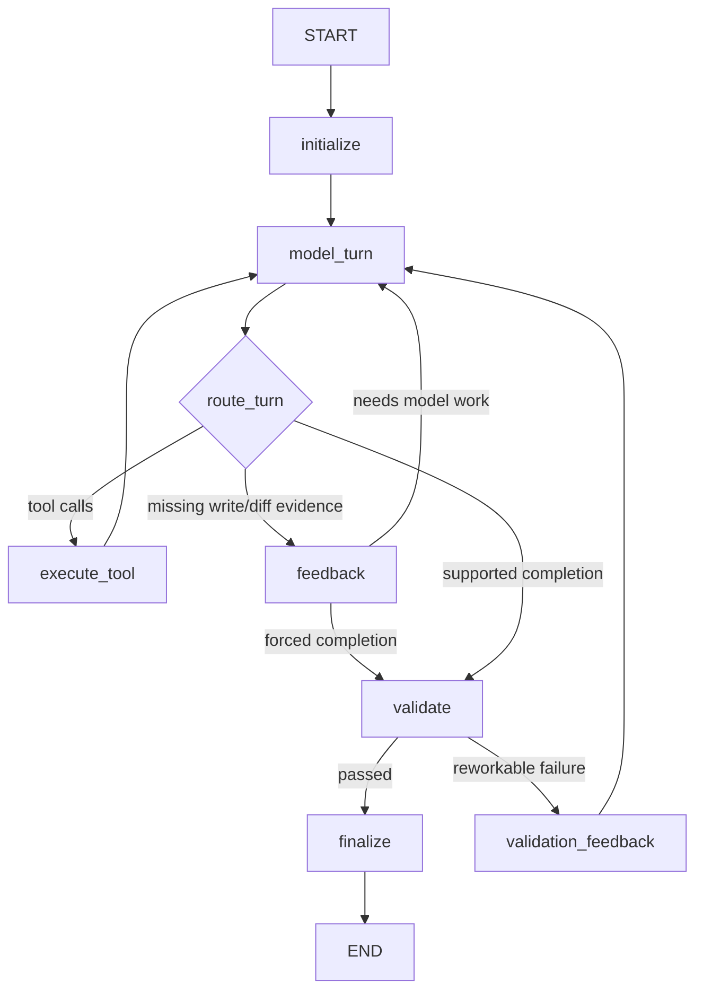

# Modifying Agent Loop

## Purpose

`solo-modifying` changes a managed Run worktree through a checkpointed model and
tool loop. It must preserve stronger safety guarantees than read-only runs:
durable tool idempotency, approval interrupt/resume, sandboxed shell execution,
patch recovery, artifact-backed large output handling, deterministic validation,
and bounded rework.

## Execution Route

A Worker may execute the graph only when:

```text
execution_kind = coding
intent = modifying
runtime_route = solo-modifying
```

Workers without model provider configuration do not advertise this route.

## Graph Topology



The graph remains the durable control-flow boundary. It owns checkpoint thread
identity, LangGraph resume, route validation, node names, conditional edges,
and terminal handoff to the Worker. Cross-cutting behavior lives behind
`ModifyingAgentLoop` and modifying middleware.

## Node Responsibilities

`initialize` enters `before_agent` and creates checkpoint-safe initial state.

`model_turn` enters `before_model`, `wrap_model_call`, and `after_model`.
Context preparation, compaction persistence, prompt budget evaluation, and
budget ledger persistence are handled by modifying middleware.

`execute_tool` enters the central modifying tool middleware. It preserves
ordered tool results, durable invocation idempotency, approval waits, sandboxed
shell execution, tool-output artifact offload, write/diff progress tracking,
and no-progress reminders.

`feedback` delegates completion evidence policy to middleware. A modifying run
cannot finish without a successful write or explicit bounded no-progress
failure path and a final `repo.diff` after the last write.

`validate` and `validation_feedback` delegate deterministic validation and
bounded rework policy to middleware.

`finalize` delegates final message event creation and result summary
construction to middleware.

## Middleware Responsibilities

- `ModifyingContextMiddleware`: prepares compacted request context and records
  context compactions.
- `ModifyingBudgetMiddleware`: loads, evaluates, persists, and exhausts token
  and wall-clock budget ledgers.
- `ModifyingToolMiddleware`: executes model tool calls through the central
  tool executor with durable invocation records.
- `ModifyingApprovalMiddleware`: creates exact approval records, emits approval
  requests, interrupts, validates resume bindings, and returns approved,
  denied, or expired tool results.
- `ModifyingArtifactMiddleware`: offloads large tool outputs to durable
  artifacts while preserving bounded inline summaries.
- `ModifyingEvidenceMiddleware`: decides tool, feedback, or validation routing
  based on tool calls, writes, and final diff evidence.
- `ModifyingValidationMiddleware`: runs deterministic validation gates, records
  verification events, and returns bounded rework feedback.
- `ModifyingFinalizationMiddleware`: emits the final assistant message and
  result summary.

## Approval And Resume

Approval remains a durable LangGraph interrupt boundary. Middleware creates a
`DurableApproval` bound to:

- run, agent, tool invocation, and tool call id;
- canonical arguments hash;
- tool version;
- workspace path and fingerprint;
- exact capabilities.

On resume, any mismatch raises corrupt runtime state. Denied or expired
approvals become structured tool errors. Pending approvals keep the Run waiting.

## Tool Idempotency And Recovery

Side-effecting tools use stable idempotency keys derived from run, agent, tool,
version, argument hash, and workspace. Replayed completed or failed tool
invocations return the stored durable result instead of repeating side effects.

Unknown shell completion fails safe as corrupt runtime state. Patch invocations
may continue through deterministic patch recovery. Repository recovery
requirements are persisted on the invocation before surfacing to the graph.

## Validation And Rework

Completion candidates route to deterministic validation. Missing gates fail the
run. Passed validation finalizes. Reworkable command failures append bounded
validation feedback to the model context until `max_rework_attempts` is
exhausted. Non-reworkable failures terminate the modifying run.

## Context, Budget, And Artifacts

Context compaction uses the shared `ContextManager` and records durable
`context_compactions`. Budget events are emitted when prompt pressure crosses
configured thresholds or exhausts the run budget. Large tool outputs are
artifact-backed and represented in checkpoint messages by bounded summaries and
artifact references.

## Failure And Recovery

| Condition | Behavior |
| --- | --- |
| transient provider error | Worker retry |
| permanent provider error | failed terminal run |
| approval pending | waiting approval interrupt |
| approval denied/expired | structured tool error, loop continues |
| unknown shell completion | recovery-required/corrupt runtime path |
| deterministic validation failure | bounded rework or failed terminal run |
| budget exhaustion | failed terminal run |
| checkpoint/workspace corruption | recovery-required terminal run |

## Completion Invariant

A successful modifying run requires a supported final answer, write/diff
evidence, deterministic validation success, a live Worker lease, and durable
events/results that can be inspected by API or frontend projections.
