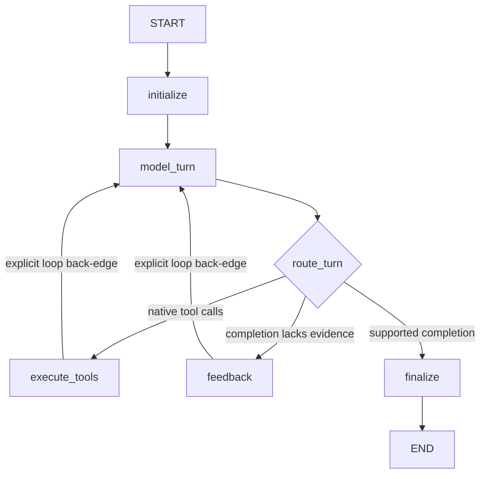

# Read-Only Agent Loop

## Purpose

`solo-readonly` is the first graph that executes a real Coding Run. It answers
a repository question by repeatedly alternating between a model turn and
bounded read-only repository tools. It never modifies the Run worktree.

The graph is a checkpointed Agent loop, not a fixed sequence. Nodes define the
allowed transitions, while each model response dynamically determines which
tools run, which files are inspected, and when a completion candidate is
offered.

## Execution Route

A Worker may execute the graph only when all route fields match:

```text
execution_kind = coding
intent = read_only
graph_name = solo-readonly
```

Modifying Runs remain queued for Task 07. Workers without a configured
DeepSeek API key advertise only the runtime-probe route and never claim Coding
Runs. Existing queued read-only Coding Runs without a graph identity are
backfilled to `solo-readonly`.

## Graph Topology



The Agent loop exists because the graph contains two explicit back edges:

```text
execute_tools -> model_turn
feedback      -> model_turn
```

A simple task may run `model -> tool -> model -> finalize`. A longer task may
list, search, and read files over several turns, reject an unsupported early
answer through `feedback`, then return to the model before finalizing. No list
of repository actions is predetermined.

## Node Responsibilities

### `initialize`

Initializes serializable graph state: Run and Leader identity,
provider-neutral messages, private continuation, counters, progress
fingerprints, and the final answer.

### `model_turn`

Builds a structured request from checkpointed messages and calls the Leader's
provider with the five read-only tool schemas. Visible reasoning may be
returned by the provider protocol, but realtime deltas are not persisted in
Task 06. Private continuation remains checkpoint-only.

### `route_turn`

- native tool calls route to `execute_tools`;
- an answer without successful repository evidence routes to `feedback`;
- a non-empty completed answer after a successful inspection routes to
  `finalize`.

### `execute_tools`

Validates raw JSON arguments with Pydantic and executes up to four independent
read calls concurrently. Results return in the model's original call order.
Correctable failures become `ToolResultMessage(is_error=true)` and follow the
explicit back edge to the model.

Fenced audit events use stable transition IDs. If a Worker fails after the
event but before the node checkpoint, replay safely repeats the read and reuses
the existing event.

### `feedback`

Rejects unsupported early completion and describes the missing evidence, then
follows its explicit back edge to `model_turn`.

At the hard turn boundary, the final request disables tools. A supported answer
may finalize; an empty or unsupported answer fails normally.

### `finalize`

Returns bounded `final_answer` and `result_summary`. The Worker writes
`Run.result_text`, marks the minimal Leader Todo done, and commits a Coding
completion event.

## Read-Only Tools

```text
repo.status
repo.list
repo.search
repo.read
repo.instructions
```

All tools resolve from the managed Run worktree and reject absolute paths,
`..`, `.git`, symlink or junction traversal, binary files, and common
credential/private-key files. They do not expose shell, network, write, patch,
commit, or approval capabilities. Search is literal text search in Task 06.

## Loop Budgets and Progress

Configurable defaults:

```text
model turns:             60
tool calls per Run:      120
parallel read tools:       4
LangGraph recursion:     256
no-progress window:        8
single tool output:   30,000 characters
single file read:         500 lines
```

These are safety boundaries, not a fixed workflow. At 70% and 90% of the model
turn budget, request-local reminders ask the model to converge. The final turn
disables tools. Tool/result fingerprints detect repeated work and trigger a
strategy-change message.

## Failure and Recovery

| Condition | Behavior |
| --- | --- |
| invalid tool JSON/schema/path | structured tool error, loop to model |
| missing/binary/sensitive file | structured tool error, loop to model |
| unsupported early answer | feedback, loop to model |
| provider rate limit/temporary outage | leave graph attempt, delayed Worker retry |
| Worker fault after read/audit | lease retry and checkpoint resume |
| authentication/permanent provider error | `failed + terminal` |
| hard budget without supported answer | `failed + terminal` |
| graph identity/checkpoint/workspace unsafe | `recovery_required + terminal` |
| lease lost | stale Worker stops; lease recovery decides the next owner |

`failed` means execution was understood but could not complete.
`recovery_required` means automatic execution cannot trust durable state.

## Completion Invariant

Completion requires a non-empty completed answer, at least one successful
repository inspection, no pending tool calls, a live Worker lease, and a valid
route/workspace. The answer must state remaining uncertainty.

Task 06 persists bounded model, tool, and final-message events. Full prompts,
full source, raw provider responses, and private continuation are excluded.
Realtime reasoning/text delta persistence remains Task 11.
