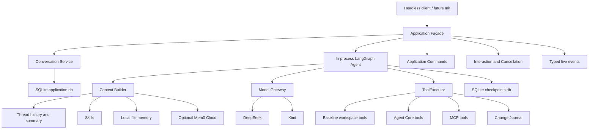

# Phase 2 Python Agent Core Design

- Status: Draft for written review
- Date: 2026-07-10
- Target branch: `codex/local-first-architecture`
- Product: Local-first AI Coding Agent

## 1. Purpose

Phase 2 builds one complete headless Python coding-agent product slice. It
does not build a general Agent Platform, hosted runtime, API service, worker
system, or distributed execution engine.

The target is a local developer tool in the product class of Claude Code CLI,
Codex CLI, Hermes, and OpenCode:

> A trusted-workspace, chat-first coding agent whose Python Agent Core runs
> locally, uses LangGraph in-process, executes tools through one mandatory
> boundary, and persists only the product state needed for local continuity and
> crash recovery.

This specification refines the accepted local-first architecture and the
pending Phase 2 parent plan. Where an older document conflicts with an explicit
decision in this specification, this specification is authoritative for Phase
2. The implementation plans must reconcile the older durable documents instead
of adding compatibility behavior.

## 2. Non-goals

Phase 2 does not include:

- Ink or React implementation;
- a LangGraph Server, `langgraph dev`, LangSmith Deployment, or an HTTP Graph
  API;
- FastAPI, hosted API, IDE plugin, or multi-client runtime;
- PostgreSQL, Worker, Queue, Lease, Job, or background scheduler;
- Docker or another sandbox backend;
- agent teams, subagents, worktree orchestration, or cloud execution;
- arbitrary OpenAI-compatible provider configuration;
- provider plugins or a general external-memory provider registry;
- MCP Streamable HTTP, OAuth, resources, prompts, sampling, or elicitation;
- image, video, binary, URL, or provider-upload attachments;
- a general Artifact system for ordinary workspace edits;
- compatibility with obsolete development data or legacy architecture tests.

## 3. Architecture principles

1. Repository state, current code, tests, and accepted design files are the
   source of truth.
2. The Python Application is the only runtime authority.
3. LangGraph owns graph execution, state snapshots, checkpoint resume, and
   interrupt mechanics.
4. The Application owns product lifecycle, commands, cancellation,
   interaction, persistence finalization, and surface contracts.
5. The ToolExecutor is the only tool execution boundary.
6. SQLite and the local filesystem are the only required persistence
   technologies.
7. Events serve live rendering; they are not durable product history.
8. Current task context, conversation history, summaries, local memory, and
   Mem0 are different concepts and remain separate.
9. Security-critical invariants are fixed code paths, not prompt conventions
   or optional middleware.
10. No compatibility layer may keep an obsolete runtime abstraction alive.
11. Phase 2 executes on the local host and describes that boundary honestly.
    Docker may later implement an optional execution backend below
    ToolExecutor; it is never the product runtime.

## 4. Target architecture



The complete normal Turn path is:

```text
User Input
  -> Surface intent
  -> Application Facade
  -> create Turn and freeze TurnConfig
  -> prepare deterministic context
  -> run in-process LangGraph
  -> Model Gateway
  -> ToolExecutor when requested
  -> normalized observation
  -> checkpointed AgentState
  -> graph produces final answer
  -> optional best-effort Mem0 distillation/write
  -> final Assistant Message and Turn commit
  -> terminal Event
  -> checkpoint cleanup
```

## 5. Application, Agent, and LangGraph boundary

### 5.1 Application responsibilities

The Application is a thin runtime. It owns:

- Application Host lifecycle;
- workspace resolution and trust;
- Session, Thread, Turn, and foreground Operation coordination;
- one active foreground Operation per Host;
- one in-progress Turn per Thread;
- typed Application Commands;
- user interactions and cancellation;
- LangGraph invocation and checkpoint-key assignment;
- durable finalization and recovery reconciliation;
- Event projection to surfaces;
- composition of concrete storage, Provider, MCP, and Mem0 adapters.

It does not implement another graph executor, custom durable state machine,
worker protocol, lease system, event store, or provider router.

### 5.2 LangGraph responsibilities

LangGraph runs as an in-process Python library. There is no separate LangGraph
server or port.

The graph is an explicit minimal `StateGraph` with the conceptual shape:

```text
prepare_context
  -> call_model
  -> route_response
     -> execute_one_tool -> call_model
     -> finalize
```

One tool call is executed per graph node and checkpoint boundary. Phase 2 does
not execute tool calls in parallel.

LangGraph owns:

- node execution and routing;
- checkpoint snapshots;
- graph resume and interrupt mechanics;
- the next-node position in a snapshot.

The graph does not own product Thread history, user commands, tool policy,
workspace trust, or Application persistence finalization.

### 5.3 AgentState

Internal graph state is a small `TypedDict`. Pydantic models are used at public
and persistence boundaries.

The state contains only:

- product `thread_id`, `turn_id`, and `workspace_key`;
- frozen Provider, model, and `thinking_enabled` values;
- Context Manifest and exact bounded model messages;
- Provider continuation state required by the originating Provider;
- pending tool calls, next tool index, and current tool results;
- model-call, tool-call, retry, and compression counters;
- accumulated Usage;
- recovery issue, final answer, and termination reason.

It does not contain:

- a duplicate node-name field;
- database connections, SDK clients, ToolExecutor instances, Event sinks, or
  file handles;
- a custom running/waiting/recovering state machine;
- Product Thread history beyond the exact current Turn context.

Runtime services are injected through LangGraph context, not checkpointed.

## 6. Conversation and persistence model

### 6.1 Product entities

The durable product model is intentionally small:

- `Thread`: a local conversation in one canonical workspace;
- `ThreadEntry`: user message, assistant message, or direct-command result;
- `Turn`: one Agent execution started from a user message;
- `ThreadSummary`: rolling summary of completed older Turns;
- `ToolActivity`: bounded terminal audit summary;
- `ChangeSet`: reversible controlled workspace mutations;
- workspace trust and MCP enablement records.

There is no Run, Job, Lease, Attempt, Worker, RecoveryTask, Approval resource,
or EventStore entity.

### 6.2 Turn lifecycle

```text
in_progress -> completed | failed | cancelled
```

Waiting, resuming, recovering, and interaction-required are live or derived
conditions. They are not durable Turn statuses.

A partial unique index enforces one in-progress Turn per Thread.

The minimal Turn row includes:

- `id`, `thread_id`, and `checkpoint_key`;
- status;
- frozen Provider, model, and thinking flag;
- user and assistant entry references;
- Usage summary, termination or error code, and timestamps.

### 6.3 Product Thread versus checkpoint

Application SQLite owns durable Thread history. Each Turn uses its `turn_id` as
LangGraph `configurable.thread_id`; the product calls this value
`checkpoint_key` to prevent confusion with a Product Thread.

Checkpoint data is temporary execution state:

- incomplete Turns keep their checkpoint;
- a successfully finalized Turn deletes its checkpoint;
- startup garbage collection deletes a leftover checkpoint if the Application
  commit already succeeded;
- if the graph completed but Application finalization did not, recovery
  reconciles idempotently from the final checkpoint;
- an in-progress Turn with a missing or corrupt checkpoint fails with a typed
  recovery error.

`/resume` resumes a Product Thread. It resumes a graph checkpoint only when the
selected Thread has an unfinished Turn.

### 6.4 ToolActivity

`tool_activities` stores terminal, safe summaries only:

- `thread_id` is required;
- `turn_id` is nullable for direct commands;
- `operation_id`, `call_id`, sequence, origin, and tool name;
- origin is `agent` or `direct`;
- terminal outcome is success, error, or cancelled;
- safe input and result summaries;
- error code, duration, optional ChangeSet reference, and timestamp;
- `(operation_id, call_id)` is unique for idempotent finalization.

It does not store running/waiting states, full file content, write bodies,
shell stdout/stderr, grep/read source, raw MCP payload, reasoning, secrets, or
pre/post images.

Execution recovery uses the graph checkpoint and Change Journal, not
ToolActivity.

### 6.5 Direct `!command`

`!command` is a Thread-bound direct Operation, not an Agent Turn. It:

- calls `ApplicationFacade.execute_direct`;
- passes through the same ToolExecutor and shell policy;
- does not call a model or create a graph checkpoint;
- creates a `direct_command` ThreadEntry containing a redacted, bounded command,
  exit status, and output of at most 30,000 characters;
- enters later Context Builder input and Thread compression;
- records a ToolActivity with `turn_id = null`;
- never enters local long-term memory or Mem0 automatically;
- does not claim that shell side effects are reversible.

## 7. Model Gateway and supported Providers

### 7.1 Official first-wave support

Phase 2 officially supports only DeepSeek and Kimi.

The curated model catalog is frozen to:

- `deepseek/deepseek-v4-flash`;
- `deepseek/deepseek-v4-pro`;
- `kimi/kimi-k2.6`;
- `kimi/kimi-k2.5`.

Newly released Provider models do not silently enter the catalog. Catalog
changes are explicit product decisions.

Provider defaults are:

- DeepSeek: `deepseek-v4-flash`;
- Kimi: `kimi-k2.6`.

There is no global cross-Provider default. When both credentials exist and no
default or Thread selection exists, an Agent Turn returns
`model_not_configured` and `/model` is required.

### 7.2 Endpoint and credential boundary

- DeepSeek uses its official API and `DEEPSEEK_API_KEY`.
- Kimi uses the official Moonshot/Kimi Open Platform and
  `MOONSHOT_API_KEY`.
- Kimi supports fixed CN and Global presets only.
- CN is the default and uses `https://api.moonshot.cn/v1`.
- Global uses `https://api.moonshot.ai/v1`.
- OpenRouter, private subscription endpoints, arbitrary OpenAI-compatible base
  URLs, and user-defined model IDs are not supported.

The official Kimi quickstarts document the
[CN endpoint](https://platform.kimi.com/docs/guide/start-using-kimi-api) and
[Global endpoint](https://platform.kimi.ai/docs/overview).

### 7.3 Selection and retry semantics

One explicit Provider and model are frozen for each Turn. `/model` affects only
future Turns.

The Model Gateway provides:

- Provider-neutral messages, tools, streams, Usage, and typed errors;
- same-Provider bounded retry before visible output;
- Provider-specific request/response adaptation;
- Provider message repair and continuation handling;
- stream normalization to product Events.

It does not provide cross-Provider fallback or task/role routing.

Retry is allowed only for connection errors, timeouts, 429 responses, and 5xx
responses before any visible text, reasoning, or tool delta. Authentication,
invalid request, schema, and protocol errors are not retryable. Once visible
output is emitted, the request is not retried.

Context-length failure invokes the Agent Loop compression path once rather than
a Provider fallback.

### 7.4 Thinking mode

`/mode` is deleted without an alias. The only command is:

```text
/thinking
/thinking on
/thinking off
```

Thinking defaults to off. Calling `/thinking` without an argument returns the
current value and a `CommandSelection`. A Turn freezes `thinking_enabled` at
creation. Provider adapters explicitly request enabled or disabled behavior and
do not rely on Provider defaults.

Reasoning deltas are live-only and are never persisted.

## 8. Agent Loop budgets

Default budgets per Turn are:

| Budget | Default | Hard maximum |
| --- | ---: | ---: |
| Model calls | 32 | 256 |
| Tool calls | 64 | 512 |
| Provider retries | 2 | 6 |
| Compressions | 2 | 10 |
| Active execution | 30 minutes | 6 hours |

Active execution excludes time waiting for an interaction response.

Every Provider request counts as a model call, including compression and Mem0
distillation calls. Tool failures are returned to the model and are not retried
by the Runtime. A final model call is reserved to summarize partial progress
with tools disabled when a loop budget is reached.

LangGraph `recursion_limit` is set above product limits as a fail-safe; it is
not the product budget. Phase 2 has no monetary budget system.

## 9. Context and compression

### 9.1 Total budget

The default total context budget is 256K tokens. It is a total model-context
budget, not pure input.

```text
effective_total = min(user_configured_total, model_context_limit)
effective_input = effective_total - 32K output reserve - 10% safety margin
```

Automatic compression begins at 80% of effective input. At the default 256K
total, the maximum estimated input is approximately 198K and automatic
compression begins near 158K.

Token estimation is local and conservative. The Runtime does not make a remote
token-count request on every Turn.

### 9.2 Deterministic Context Builder

The Context Builder owns ordered, typed `ContextSource` inputs. It is not prompt
middleware.

It preserves:

- product and safety instructions;
- trusted workspace instructions;
- the explicitly selected Skill;
- current user input;
- explicit `@path` snapshots;
- the current unclosed assistant/tool chain;
- Provider continuation data needed by the originating Provider.

It also assembles bounded Thread summary, recent completed Turns, local memory,
Mem0 recall, and tool observations.

The exact bounded model messages and manifest are frozen in the current Turn
checkpoint. SQLite stores only manifest metadata: source kind, source ID,
order, estimate, truncation, hash, and covered message range.

### 9.3 Thread compression

Each Thread has at most one rolling summary containing:

- content;
- covered message sequence;
- covered Turn count and estimated tokens;
- Provider, model, and timestamp.

Compression summarizes only completed Turns, using the previous summary plus
newly uncovered older messages. The latest four full Turns remain uncompressed.

The summary preserves goals, decisions, files, validation, failures, and
unresolved work. It is untrusted, non-authoritative context and is never
automatically copied into local memory or Mem0.

`/compact` invokes the same mechanism. A failed compression never deletes
history. If the original context still fits, the Turn proceeds with a warning;
otherwise it ends with `context_unrecoverable`.

### 9.4 `@path`

Phase 2 supports text-only, workspace-relative explicit paths:

- at most 32 paths;
- at most 25% of effective input;
- preserve user order and deduplicate exact paths;
- files use normal read safety and include at most 500 lines;
- directories include one level with at most 200 entries;
- no recursive directory injection;
- no path escape, unsafe symlink, sensitive file, binary, image, URL, glob, or
  Provider upload;
- invalid explicit paths fail before the model call;
- content is frozen for the Turn and not persisted as Application history.

## 10. Tool system

### 10.1 Stable baseline, not a fixed total

The following eight tools form the stable baseline workspace set:

- `ls`: List files in a directory;
- `read_file`: Read file contents;
- `write_file`: Create a new file, or overwrite an existing one;
- `edit_file`: Perform exact string replacements in files;
- `delete`: Delete a file, or a directory and its contents recursively;
- `glob`: Find files matching a glob pattern;
- `grep`: Search file contents;
- `execute`: Run shell commands.

They are not the maximum tool count. Phase 2 can add genuine Agent Core tools,
MCP tools are dynamic, and future User tools may be added by an explicit later
design.

Tool categories are:

- baseline workspace tools;
- Agent Core tools, including Skill and enabled local-memory operations;
- MCP tools named `mcp.<server_id>.<tool_name>`;
- future User tools named `user.<package>.<tool_name>`.

### 10.2 Mandatory execution boundary

Every model-callable tool passes through:

```text
Registry
  -> JSON Schema validation
  -> fixed policy and workspace checks
  -> execution
  -> bounded normalized result
  -> Change Journal where applicable
  -> ToolActivity finalization
  -> Event
```

No Skill, MCP Server, Provider, or future User tool may bypass this path.

Phase 2 provides only a local-host execution backend for `execute`. Workspace
trust, canonical-path containment, command policy, and a Git worktree are not
described as a sandbox. A future Docker sandbox may implement the same execution
backend port without changing the Agent Loop or Tool contract.

Read-only tools may be rerun during recovery. Controlled file mutations use
Change Journal reconciliation. `execute` and MCP calls with unknown external
side effects are never automatically rerun after an uncertain crash. The user
receives a `retry | abort` recovery interaction.

## 11. Skills

Skills follow the open Agent Skills `SKILL.md` format. `name` and `description`
are required. `license`, `compatibility`, and `metadata` are optional.

The legacy fields `requested_tools`, `required_capabilities`, `risk_level`,
actor kinds, routes, and team assignments are removed. `allowed-tools`, when
present, is parsed for diagnostics but never grants permission.

Discovery roots are:

1. bundled package resources;
2. `<AWESOME_HOME>/skills/<name>/SKILL.md`;
3. trusted workspace `.agents/skills/<name>/SKILL.md`.

A plain workspace `skills/` directory is not automatically discovered.

Precedence is workspace over user over bundled. `/skills` reports effective and
shadowed sources. User configuration may disable a source or Skill.

Startup loads metadata only. Full instructions load on activation. Referenced
resources load on demand. A Turn has at most one main Skill.
The main `SKILL.md` body is capped at approximately 5,000 estimated input
tokens. Referenced resources have their own bounded reads.

Model-facing read-only tools are:

- `load_skill(name)`;
- `read_skill_resource(name, relative_path)`.

Both use ToolExecutor, are bounded, and are visible. Skill scripts can run only
through `execute` and normal policy.

Initial bundled Skills are `init`, `review`, `debug`, `test`, and
`git-workflow`.

## 12. MCP

### 12.1 Phase 2 scope

Phase 2 uses the official stable MCP Python SDK with a `<2` dependency bound
while v2 remains pre-release. It supports:

- stdio transport only;
- tools only;
- one long-lived Client Session per enabled Server for the Application Host
  lifetime.

It does not support Streamable HTTP, OAuth, resources, prompts, sampling,
elicitation, registry browsing, marketplace installation, or dynamic package
installation.

The current hand-written JSON-RPC and hard-coded protocol implementation is
deleted rather than wrapped.

The Phase 2 command family is fixed to:

- `/mcp` and `/mcp status [id]`;
- `/mcp enable <id>`;
- `/mcp disable <id>`;
- `/mcp restart <id>`.

### 12.2 Lifecycle and failure isolation

Configuration is parsed at startup. Enabled Servers are initialized lazily
before the first Agent Turn that needs the effective tool inventory. Successful
stdio Sessions are reused.

One failed Server removes only that Server's tools. Baseline tools and other
Servers continue. `/mcp status` and `/doctor` expose safe diagnostics.

A broken connection may be re-established for future calls, but an uncertain
tool call is never replayed automatically.

### 12.3 Trust and enablement

User-configured MCP Servers are user-authorized. Workspace declarations are
read only after workspace trust and require a separate first `/mcp enable
<id>`.

Enablement binds a hash of Server ID, command, arguments, and environment-name
declarations. A configuration change invalidates enablement.

Enabling a Server authorizes its current and future tools. Phase 2 does not add
per-tool approval, risk override, or capability matrices. MCP annotations are
untrusted metadata for display and diagnostics, not authorization.

Each Server receives a minimal process environment plus explicitly named
variables. Secret values never enter configuration, events, SQLite, or logs.

## 13. Memory

### 13.1 Independent layers and defaults

Local file memory and Mem0 Cloud are independent, additive layers. Each has its
own switch and both default to off.

```text
local_file_memory = false
mem0_cloud = false
```

There is no mirroring, double write, shared ID, or delete synchronization
between them. They meet only in the Context Builder.

### 13.2 Local file memory

Paths are:

- `<AWESOME_HOME>/memory/USER.md` for cross-workspace user preferences;
- `<AWESOME_HOME>/workspaces/<workspace_key>/MEMORY.md` for workspace facts.

The files are free Markdown with an Agent-managed section. Managed entries use
stable IDs in unobtrusive HTML comments. User-authored content outside the
managed section is read but never rewritten by Agent CRUD.

The model-facing Agent Core tools are:

- `memory_list`;
- `memory_add`;
- `memory_replace`;
- `memory_remove`.

They are exposed only when local memory is enabled. Their model contract permits
mutation only in response to explicit current-Turn user intent. The Runtime
applies deterministic content policy but does not attempt brittle
natural-language intent classification. Every mutation remains visible as a
tool call. There is no automatic post-Turn local write.

Application-level management commands are:

- `/memory`;
- `/memory local on|off`;
- `/memory mem0 on|off`;
- `/memory list user|workspace`;
- `/memory add user|workspace <content>`;
- `/memory replace user|workspace <id> <content>`;
- `/memory remove user|workspace <id>`;
- `/memory mem0 search <query>`;
- `/memory mem0 remove <id>`.

Phase 2 does not expose a bulk Cloud reset command. Mem0 removal verifies that
the selected ID belongs to the configured user/application scope before
deletion.

Writes are atomic and compare the previously read content hash. Concurrent
manual edits return a conflict instead of being overwritten.

### 13.3 Mem0 Cloud

Mem0 Cloud is the only external memory service. The integration uses a
dedicated async adapter, not a generic Provider registry. The key comes only
from `MEM0_API_KEY`.

Identity is opaque:

- `user_id`: locally generated or explicitly user-configured opaque ID;
- `app_id`: `awesome-agent`;
- user memories have `metadata.scope = user`;
- workspace memories have `metadata.scope = workspace` and an opaque
  `workspace_key`.

No username, email, absolute path, repository name, or Git Remote is uploaded.
Changing the configured user ID changes the Cloud namespace; Phase 2 performs
no migration.

Recall queries current global-user and current-workspace memories only. Other
workspaces are excluded at the remote filter boundary.

After the graph produces a successful final answer, but before the Application
commits the completed Turn, a bounded Memory Distiller may use the current
selected model with tools disabled to produce at most five stable candidates of
at most 500 characters each. The call counts toward the Turn model budget and
Usage. It is skipped when no model-call budget remains. Only current user
natural language and final answer are eligible input; source, diff, tool output,
reasoning, attachment, and history bodies are excluded.

Candidates pass deterministic redaction and eligibility policy. Eligible facts
are written with `infer=false`. A normalized fact hash in remote metadata
supports remote duplicate checks without a local synchronization table.

Distillation, recall, dedupe, and writes are all fail-open. Mem0's asynchronous
write event is not polled by a Worker and no local upload queue is created.

### 13.4 Memory context budget

| Source | Maximum estimated input tokens |
| --- | ---: |
| `USER.md` | 4K |
| workspace `MEMORY.md` | 8K |
| Mem0 recall | 4K |
| total long-term memory | 16K |

The effective memory budget is also capped at 10% of effective input. When the
total is smaller, the split is 25% user, 50% workspace, and 25% Mem0. Unused
memory capacity returns to the general context budget and does not enlarge
another memory source.

Mem0 recall has a three-second timeout and returns at most eight results. Exact
normalized duplicates prefer `USER.md`, then workspace `MEMORY.md`, then Mem0.
Conflicting facts remain separately source-labelled.

## 14. Configuration

### 14.1 Files

The target keeps only:

```text
<AWESOME_HOME>/config.yaml
<AWESOME_HOME>/.env
<workspace>/.awesome/config.yaml
```

Legacy user `config.toml`, user `awesome-agent.yaml`, and root project
`awesome-agent.yaml` are removed without migration.

### 14.2 Authority by field

There is one typed loader and resolver, but no universal merge chain.

- CLI and explicitly documented environment variables own startup overrides.
- Process environment and user `.env` own secrets.
- User configuration owns Provider defaults, budgets, memory enablement,
  Mem0 identity, user Skills, and user MCP Servers.
- Trusted workspace configuration owns project Skills, project MCP
  declarations, and safe reductions of project limits.
- Thread SQLite state owns current model, thinking flag, and Skill mode.
- Workspace configuration cannot define secrets, enable Mem0, auto-enable MCP,
  raise a user limit, or mark itself trusted.

Safety and budget limits merge by taking the most restrictive applicable
value. Provider selection follows CLI override, an explicitly documented
environment override, Thread selection, user default, then the default of the
only configured Provider. Thinking and Skill selection use the same ordering
for sources that are allowed to define those values.

Automatic file watching and hot reload are deferred. Application initialization
creates an immutable config snapshot; Turn creation creates an immutable Turn
snapshot. Typed commands update their specific state, while manual config edits
require a Host restart.

Unknown fields and invalid values are not silently ignored. Agent Turns fail
with `configuration_invalid`, while `/config`, `/doctor`, workspace, and local
diagnostic operations remain available. Secrets are rendered only as
configured or missing.

## 15. Slash Command contract

Slash Commands are typed Application intents outside the graph.

### 15.1 Application Commands

- `/new [title]`;
- `/resume [thread_id]`;
- `/context`;
- `/compact`;
- `/model [provider/model]`;
- `/thinking [on|off]`;
- `/workspace [revoke]`;
- `/diff [change_set_id]`;
- `/undo [change_set_id]`;
- `/redo [change_set_id]`;
- `/tools`;
- `/skills`;
- `/skill [auto|off|name]`;
- `/mcp ...`;
- `/memory ...`;
- `/status`;
- `/usage`;
- `/doctor`;
- `/config`.

### 15.2 Skill-backed Commands

- `/init`;
- `/review`;
- `/debug`;
- `/test`;
- `/commit`.

They preload the mapped Skill and submit a normal Turn. They do not create
graph branches.

### 15.3 Future Ink-local Commands

- `/help`;
- `/theme`;
- `/details`;
- `/copy`;
- `/editor`;
- `/quit`.

They never enter the Python Agent Core.

`/mode`, `/threads`, `/history`, and `/attach` are removed. `/clear`,
`/permissions`, `/sandbox`, `/api`, `/agent`, and `/team` are not introduced.
`@path` and `!command` are input forms, not Slash Commands.

Selection commands return a surface-neutral `CommandSelection` containing a
prompt and `CommandOption` records. A `CommandOption` contains `value`, `label`,
an optional `description`, and `selected`; `CommandSelection` contains `prompt`
and `options` and is an optional field on `CommandResult`. The Application
stores no pending selection state; the Surface submits the selected argument as
a new command.

### 15.4 Built-in semantics

`built-in` is a packaging and source label, not a separate execution
abstraction. Baseline workspace tools are built-in tools, while `init`,
`review`, `debug`, `test`, and `git-workflow` are bundled Skills. They still use
the normal Registry, ToolExecutor, Skill loader, policy, Event, and Application
boundaries. There is no general BuiltinExecutor or privileged built-in bypass.

## 16. Application Facade and stdio protocol

### 16.1 Facade

The single surface-neutral Application Facade exposes:

- `initialize`;
- `get_state`;
- `list_threads`;
- `read_thread`;
- `submit_turn`;
- `execute_direct`;
- `execute_command`;
- `respond_interaction`;
- `cancel_operation`;
- `shutdown`.

Headless Python tests may call it in process. Future Ink calls the same behavior
through stdio.

### 16.2 JSON-RPC over stdio

Phase 2 implements protocol version 1 using JSON-RPC 2.0 and one UTF-8 JSON
object per line.

Methods are:

- `initialize`;
- `application.getState`;
- `thread.list`;
- `thread.read`;
- `turn.submit`;
- `direct.execute`;
- `command.execute`;
- `interaction.respond`;
- `operation.cancel`;
- `shutdown`.

`stdout` is protocol-only; `stderr` is logging-only. One Surface owns one Host.
There is no port, authentication layer, multi-client session, or HTTP server.

Expected product errors use typed Results and Events. Malformed JSON, unknown
methods, and protocol violations use JSON-RPC errors.

## 17. Event contract

Events are normalized product notifications, not raw Provider, LangGraph, MCP,
or logging payloads.

The envelope contains:

- version, event ID, and monotonic Session sequence;
- Session and workspace identity;
- optional Thread, Turn, and Operation IDs;
- event type, timestamp, and typed payload.

Stable event families are:

- `operation.started|completed|failed|cancelled`;
- `turn.started|completed|failed|cancelled`;
- `assistant.text.delta`;
- `assistant.reasoning.delta`;
- `provider.retrying`;
- `tool.started|completed|failed|cancelled`;
- `context.prepared|compressed`;
- `usage.updated`;
- `workspace.changed`;
- `memory.status`;
- `interaction.required|resolved`;
- `warning`.

Reasoning is live-only. Tool and Context Events contain safe summaries and
metadata, not raw bodies. Tracebacks never cross the protocol.

Every accepted Operation emits exactly one terminal Operation Event. Every
started Turn emits exactly one terminal Turn Event. `turn.completed` occurs
only after the Assistant Entry and Turn status commit to SQLite.

Events are not persisted or replayed. Adjacent text and reasoning deltas may be
coalesced without reordering. Structural and terminal events are not dropped.
After restart, a Surface rebuilds from Application state and Thread reads.

## 18. Middleware boundary

Phase 2 retains only light Application-boundary Middleware for:

- correlation context;
- tracing spans;
- redacted start/success/failure logging;
- latency, count, and Usage metrics.

Middleware must call the next operation exactly once, cannot alter inputs or
outputs, and rethrows observed exceptions.

It cannot implement Agent routing, retries, fallback, budgets, compression,
message repair, Tool execution, policy, persistence, recovery, event semantics,
or context injection.

Behavior belongs to explicit components:

| Behavior | Owner |
| --- | --- |
| Reasoning route, tool sequence, termination | Agent Loop |
| Loop budgets, compression trigger | Agent Loop |
| Stream normalization and safe retry | Model Gateway |
| Context sources, ordering, truncation | Context Builder |
| Schema, policy, execution, result | ToolExecutor |
| Trust, Commands, Turn lifecycle | Application |
| Checkpoint and graph resume | LangGraph plus Application coordination |
| Change recovery | Change Journal |
| Logging, tracing, metrics | Middleware/Observers |

The current behavior-heavy read-only, modifying, team, and Skill-context
Middleware stacks are deleted without compatibility wrappers.

## 19. Target source layout

```text
src/awesome_agent/
├── application/
├── agent/
├── context/
├── conversation/
├── core/
│   ├── workspace/
│   ├── tools/
│   └── changes/
├── modeling/
├── providers/
├── extensions/
│   ├── skills/
│   └── mcp/
├── memory/
├── config/
├── storage/
├── protocol/
├── observability/
├── safety/
└── paths.py
```

The final target has no general `runtime/` package. `application/` is the thin
Runtime, `agent/` is the Agent Core, and `protocol/` contains Surface adapters.

Phase 3 creates TypeScript only under `ui/ink/` and deletes the Python Textual
package. TypeScript never enters the Python package or implements Agent logic.

Dependency direction is inward:

```text
protocol / CLI / future Ink
             -> application
             -> agent / context / conversation
             -> modeling / memory / extensions
             -> core and storage ports
```

Concrete Provider, MCP, Mem0, and SQLite adapters are assembled only at the
composition root. They are not imported by Protocol-independent domain models.

## 20. Legacy deletion boundary

Phase 2 directly replaces:

- the old AgentLoop Middleware Stack;
- task/role/route Provider routing;
- handwritten MCP JSON-RPC;
- the general external MemoryProvider abstraction and double-write service;
- PostgreSQL-dependent Thread/Turn paths used by the new Host;
- duplicate Settings/config entry points;
- structural tests that require exactly eight total tools.

Legacy API, Client, Textual, PostgreSQL persistence, Worker, orchestration,
sandbox service, Artifact/Attachment, Team Agent, and worktree modules may
temporarily remain only while Phase 3/4 owns their physical deletion. Structural
tests must prove the new Host does not import them. This temporary presence is
not a compatibility promise or a fallback architecture.

## 21. Validation strategy

Phase 2 uses target-contract tests, not the legacy full suite.

Every PR runs:

1. format and lint;
2. Python type checking;
3. new unit tests for the current Unit;
4. affected retained Phase 1 contract tests;
5. the smallest relevant integration test;
6. structural dependency tests.

Tests tied to a deleted implementation are deleted in the same PR. A retained
behavior with an obsolete test is covered by a new contract test. No
compatibility layer may be added to satisfy an old test.

Required Phase 2 exit validation includes:

- all retained Phase 1 and new Phase 2 tests;
- a fresh temporary `AWESOME_HOME`;
- networkless Headless and stdio end-to-end tests;
- fake DeepSeek and Kimi streams;
- a local MCP fixture Server using the official SDK;
- fake Mem0 boundaries and all fail-open cases;
- crash and checkpoint resume;
- cancellation and interaction;
- read, edit, execute, diff, undo, and redo;
- direct `!command` followed by an Agent Turn using its output;
- structural proof that the target Host imports no PostgreSQL, Worker,
  FastAPI, Docker, Textual, or legacy Runtime.

Real Provider and Mem0 calls are optional manual smoke checks, never required
CI gates.

## 22. Implementation sequence

Phase 2 is delivered through eight strictly sequential PRs:

1. Config, Conversation, and Storage Foundation;
2. Provider-neutral Model Gateway;
3. LangGraph Agent Loop;
4. Context, Compression, and `@path`;
5. Skills and MCP;
6. Local File Memory;
7. Mem0 Cloud;
8. Headless and stdio Product Closure.

Each PR starts from the latest `codex/local-first-architecture`, passes its
target gates, is pushed and reviewed, and merges back to
`codex/local-first-architecture` before the next PR begins. Nothing merges to
`main` until all architecture phases are complete.

## 23. Phase 2 exit criteria

Phase 2 is complete only when:

- a developer can start a trusted local Python Host without PostgreSQL,
  Worker, FastAPI, Docker, Node, or Textual;
- a normal message completes a DeepSeek or Kimi LangGraph Turn through the
  common Model Gateway and ToolExecutor;
- local SQLite history and temporary checkpoint recovery behave as specified;
- Context, compression, `@path`, Skills, MCP, local memory, and Mem0 respect
  their budgets and trust boundaries;
- Commands, direct execution, cancellation, interactions, Events, and state
  queries work through the Application Facade;
- the stdio reference client can complete and recover the full product flow;
- no target module imports a legacy Runtime authority;
- the accepted Phase 2 tests pass with recorded evidence.

Only after these gates pass may Phase 3 build the Ink + React Surface.
