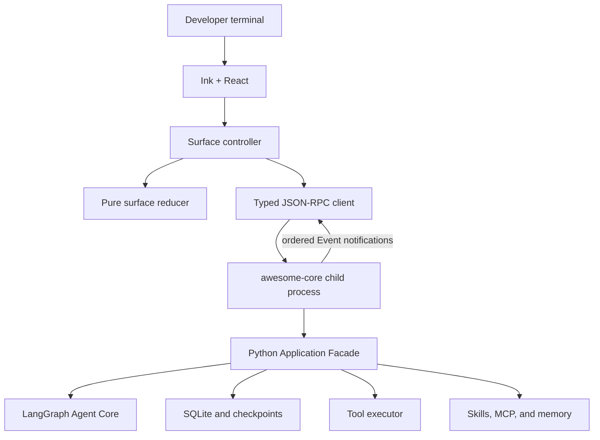

# Phase 3 Ink Surface Detailed Design

> Status: conversational design accepted; pending written-spec review
>
> Date: 2026-07-11
>
> Target branch: `codex/local-first-architecture`

## 1. Product outcome

Phase 3 delivers the complete TypeScript Ink + React product candidate for
Awesome Agent. Python remains the only owner of product and Agent behavior.
Ink owns process presentation, terminal input, rendering, keyboard behavior,
and explicitly local UI preferences.

Phase 3 does not replace Python, run a LangGraph server, add HTTP, or move
model, tool, memory, persistence, trust, or change-journal decisions into
TypeScript. It does not switch the existing `awesome` entry point or delete
Textual. Those cutover and deletion steps belong to Phase 4.

The Phase 3 candidate requires Python 3.12, Node.js 22 LTS, and an installed
`awesome-core` executable on `PATH`. It does not download or install either
runtime automatically.

## 2. Sources of truth

This design refines and, where explicitly stated, corrects:

- `docs/architecture/local-first-target.md`;
- `docs/architecture/decisions/0004-fixed-tools-change-journal-and-commands.md`;
- `docs/architecture/decisions/0006-python-core-and-ink-stdio-boundary.md`;
- `docs/superpowers/specs/2026-07-10-phase-2-python-agent-core-design.md`;
- `.codex/exec-plans/pending/local-first-rewrite-phase-3-ink-surface.md`.

Repository code remains the authority for what Phase 2 currently implements.
This design does not assume the Phase 2 protocol is complete merely because a
plan described it as frozen.

## 3. Goals

Phase 3 must provide:

1. one scrollback-first Ink chat surface over the Python stdio Host;
2. strict protocol and product-version startup validation;
3. bounded Thread hydration and live Event rendering;
4. trust, diagnostics, model selection, memory, skills, MCP, direct shell,
   changes, cancellation, and recovery UX;
5. a Unicode-safe multiline composer and stable command picker;
6. networkless cross-language and complete product-flow tests;
7. a candidate `awesome-tui` executable suitable for Phase 4 cutover.

## 4. Non-goals

Phase 3 does not include:

- an all-TypeScript Agent implementation;
- HTTP, WebSocket, FastAPI, LangGraph Server, or multi-client sessions;
- automatic Python or Node installation;
- a bundled Node or Python runtime;
- PostgreSQL, Worker, Docker sandbox, or hosted mode;
- a full-screen dashboard, alternate screen, permanent sidebar, or mouse UX;
- unlimited transcript history browsing;
- workspace file reads or tool execution from TypeScript;
- a schema/code-generation pipeline;
- default-entry cutover, Textual deletion, or broad legacy removal.

## 5. Phase 2 corrections required before Ink

Phase 2 established the correct ten-method Facade and stdio direction, but the
implemented boundary has five product-blocking gaps:

1. `PROTOCOL_VERSION` exists but `initialize` performs no client/Host version
   handshake.
2. Expected failures such as operation busy and Thread not found can become
   JSON-RPC `-32603 Internal error`.
3. `thread.list` and `thread.read` are unbounded despite a 1 MiB NDJSON frame
   ceiling.
4. `thread.read` does not return the ChangeSet summaries needed to reconstruct
   a durable transcript after restart.
5. `/status` returns a loose `ApplicationState` dictionary rather than a
   stable status contract.

Phase 3 also removes `/editor` and `/details`. No compatibility aliases are
retained. These changes happen before TypeScript becomes a consumer so that
Ink does not encode known contract defects.

## 6. Target architecture



The surface controller translates user intent into Facade requests and
translates validated responses/Events into reducer actions. It does not decide
whether a tool is allowed, how a Turn runs, which memory is injected, or when
state is durable.

## 7. TypeScript project and dependencies

The repository adds one standalone `tui/` npm package. It is not an npm
workspace or monorepo. `package-lock.json` is committed and `npm ci` is the
canonical install command.

Production dependencies are limited to:

- React;
- Ink;
- Zod for runtime protocol validation;
- `clipboardy` behind a small clipboard adapter.

Development dependencies are limited to TypeScript, Biome, Vitest,
`ink-testing-library`, and the required React type packages. `tsc` builds ESM
for Node.js 22 using Node-compatible module resolution. Phase 3 does not add a
bundler, Redux, XState, React Query, frontend router, or dependency-injection
container.

The TypeScript gate is:

```text
npm ci
npm run format:check
npm run lint
npm run typecheck
npm test
npm run build
```

## 8. Process ownership and lifecycle

One Ink process owns exactly one `awesome-core` child at a time.

1. The TUI parses only surface launch flags.
2. It resolves `awesome-core` from `PATH` and spawns it with the selected
   workspace as `cwd` and the current environment.
3. stdin and stdout are private NDJSON pipes. Core stderr is captured in a
   64 KiB tail ring.
4. The TUI performs `initialize` before reading workspace or Thread state.
5. The TUI hydrates Application state and one bounded Thread page.
6. The TUI accepts user input only after trust or ready state is resolved.

Core stdout is protocol-only. A malformed stdout frame is protocol corruption,
not a log line. stderr is never inserted into normal transcript history.

On normal `/quit` or EOF, Ink sends `shutdown` and waits five seconds. It
terminates the child only after that deadline. On unexpected Core exit, Ink
retains already rendered scrollback, disables new input, shows the exit code
and a safe summary, and offers explicit reconnect or quit. It never restarts
automatically.

Reconnect starts a new Host for the same workspace and Thread, runs initialize,
reads current Application state and the latest Thread page, and performs no
Event replay. The Welcome Logo is not printed a second time; reconnect adds a
single status line.

Exit codes are:

- `0`: normal quit, EOF, or trust denial;
- `2`: invalid arguments, missing runtime/Core, or incompatible version;
- `1`: unrecovered protocol corruption, Core crash, or TUI failure.

## 9. Protocol v1 closure

### 9.1 Initialize handshake

The method name remains `initialize`. It accepts a required payload containing:

- `protocol_version`, exactly `1`;
- `client_name`, exactly `awesome-tui` for the Phase 3 client;
- `client_version`, the product semantic version.

The success value contains the Host product version, protocol version, Session
identity, initialization status, pending trust interaction if any, and product
capabilities. Both Python and npm packages use one product version. Contract
tests fail when their versions differ.

Protocol or product-version incompatibility is reported before trust,
workspace extensions, Thread recovery, or Agent initialization. Phase 3 does
not negotiate version ranges or retain old-client behavior.

### 9.2 Uniform Application result

All ten Facade methods return one generic product envelope:

```text
ApplicationResult<T>
  ok: true
  value: T

or

ApplicationResult<T>
  ok: false
  error: ProductError
```

The two shapes are mutually exclusive and validated. Expected failures use a
specific `ProductErrorCode`; Python does not parse arbitrary exception strings
to infer them. Unexpected invariant failures remain JSON-RPC `-32603` and never
expose a traceback.

Malformed JSON, invalid requests, unknown methods, invalid params, and internal
protocol faults continue to use standard JSON-RPC errors. Event notifications
do not use `ApplicationResult`.

### 9.3 Bounded Thread methods

The method table remains exactly:

- `initialize`;
- `application.getState`;
- `thread.list`;
- `thread.read`;
- `turn.submit`;
- `direct.execute`;
- `command.execute`;
- `interaction.respond`;
- `operation.cancel`;
- `shutdown`.

`thread.list` accepts an opaque cursor and limit. The default is 50 and the
maximum is 200. Results are ordered by most recent update first and return an
opaque next cursor plus `has_more`.

`thread.read` accepts `thread_id`, optional `before_sequence`, and limit. The
default is 100 and the maximum is 500. It returns:

- Thread metadata;
- the bounded Entry page;
- page-associated Turn summaries;
- page-associated terminal ToolActivity summaries;
- page-associated ChangeSet summaries;
- current conversation summary;
- `has_more` and `next_before_sequence`.

Ink requests 50 entries for initial or resumed hydration. It does not intercept
terminal scroll or implement infinite history loading. When older entries
exist, it prints an omission notice; the Agent's summary, SQLite history, and
checkpoint remain available to Python.

Every response remains independently bounded below the 1 MiB transport frame
ceiling.

`initialize` may expose the canonical workspace display path required for the
trust prompt, but it does not inspect project content before trust. After trust,
`application.getState` returns a surface-safe workspace presentation containing
the canonical display path and optional Git branch. Python produces both
values; TypeScript does not inspect `.git` or the workspace filesystem. The
branch is used by Welcome only and is intentionally absent from `/status`.

### 9.4 Shared fixtures, not code generation

Python Pydantic models remain the protocol semantic authority. Python emits a
committed, versioned fixture corpus containing valid and invalid examples for:

- handshake;
- all ten methods;
- `ApplicationResult` success and failure;
- every Event type;
- pagination boundaries;
- JSON-RPC errors.

TypeScript maintains explicit Zod schemas and inferred TypeScript types. Both
languages execute the same fixture corpus. No JSON Schema or TypeScript code
generation is introduced until a second real external consumer or materially
larger protocol justifies it.

## 10. Event client and reducer

Request IDs are monotonically increasing within one Host lifetime and are
never reused. The client owns one pending-request map.

Event sequence must be strictly contiguous. Duplicate, decreasing, or missing
sequence values enter protocol-fatal state because the local pipe has no valid
reason to drop a structural Event. The TUI stops accepting new input and offers
explicit reconnect.

Adjacent text or reasoning deltas for the same Turn may be coalesced for at
most one render tick. A structural, tool, interaction, lifecycle, or terminal
Event flushes pending deltas before it is reduced. Structural and terminal
Events are never coalesced or dropped.

The pure reducer owns only:

- connection and handshake state;
- current Application and Thread view state;
- the current dynamic Operation/Turn;
- composer and current-process input history;
- picker, trust, help, fatal, and reconnect overlays;
- theme preference and transient warnings.

It performs no RPC, process, filesystem, or clipboard effects. Components
consume view models and callbacks. Effects live in the surface controller.

## 11. Package and file boundaries

The target TypeScript structure is:

```text
tui/src/
  cli/          launch arguments, version checks, exit codes
  core/         awesome-core child lifecycle and stderr ring
  protocol/     Zod schemas, NDJSON, RPC client, fixtures
  state/        pure reducer and selectors
  transcript/   durable/live records to display blocks
  commands/     input classification, command metadata, local handlers
  composer/     Unicode text buffer, cursor, paste, history
  components/   transcript, active Turn, picker, trust, help, fatal
  preferences/  theme and ui.json
  app/          composition only
```

`App.tsx` must not become a protocol parser, command dispatcher, or monolithic
state machine. `RpcClient` has no React/Ink dependency. Component tests do not
spawn Python unless the test explicitly crosses the process boundary.

## 12. Scrollback-first rendering

Ink does not enter alternate screen. It does not own a permanent viewport or
sidebar and does not enable mouse input.

Rendering has two layers:

1. completed content is committed through Ink `<Static>` to native terminal
   scrollback;
2. the current Operation/Turn, composer, one status line, and active overlay
   remain dynamic.

The default transcript is permanently Balanced; there is no display-mode
toggle. It shows:

- user input;
- Assistant text;
- one safe summary line per tool call;
- automatic safe error detail for failed tools;
- one ChangeSet summary with changed paths and reversibility;
- direct-command results as labelled direct entries;
- compact usage/status metadata where it materially explains the Turn.

On a terminal lifecycle Event, Ink reads the latest bounded durable Thread
page. It reconciles Assistant Entry, ToolActivity, and ChangeSet summaries
against SQLite-backed data before committing the completed block to Static.
If reconciliation fails, it retains the visible transient result, labels it as
not reconciled, and does not pretend persistence succeeded.

## 13. Reasoning display

Thinking defaults to off and remains a Python Thread/Turn setting.

When thinking is on, reasoning is displayed only in the current dynamic Turn.
The TypeScript display buffer retains at most 32,000 UTF-16 code units. On
overflow it discards the oldest visible text and adds:

```text
… earlier reasoning omitted from live view
```

This is a rendering-memory bound, not a model reasoning or token limit. It
does not cancel, truncate, or alter Provider execution.

At Turn completion, Ink replaces reasoning with a one-line elapsed-time marker,
discards the text from TypeScript state, and commits only the marker. Reasoning
is not copied, persisted, rebuilt, or returned after restart.

## 14. Welcome and theme

Workspace trust is resolved before Welcome. Trust denial exits without loading
project instructions. Once ready, the initial TUI process prints one large
Logo. Reconnect within the same process does not print it again.

The Logo uses the exact README block glyph without its outer box:

```text
  ███  █   █ █████ █████  ███  █   █ █████
 █   █ █   █ █     █     █   █ ██ ██ █
 █████ █ █ █ ████  █████ █   █ █ █ █ ████
 █   █ ██ ██ █         █ █   █ █   █ █
 █   █ █   █ █████ █████  ███  █   █ █████
```

The outer frame is removed because box-drawing and block-glyph widths can
misalign across fonts and terminal engines. The block Logo itself is the
visual boundary.

For dark theme, its five rows use the accepted Mint palette:

```text
#A7F3D0
#6EE7B7
#34D399
#2DD4BF
#22D3EE
```

Light theme uses darker Mint equivalents with adequate contrast. System theme
uses terminal-provided named ANSI colors. TrueColor emits exact RGB values;
256-color mode maps each RGB value to the nearest standard xterm cube color;
16-color mode uses the closest green/cyan sequence. `NO_COLOR` or absent color
support produces a single default-foreground Logo.

At terminal widths of at least 44 columns, Ink uses the full Logo. At 36–43
columns it uses this exact five-row compact block fixture:

```text
 ██  █  █ ████  ███  ██  █  █ ████
█  █ █  █ █    █    █  █ ████ █
████ ████ ███   ██  █  █ ████ ███
█  █ ████ █       █ █  █ █  █ █
█  █  ██  ████ ███   ██  █  █ ████
```

Below 36 columns it shows a width diagnostic rather than rendering a broken
Logo or interface.

Welcome contains no marketing tagline. Below the Logo it renders:

```text
E:\projects\awesome · feature/auth · new thread
deepseek/deepseek-v4-flash · thinking off · local memory off · mem0 off

/ commands · @path context · ! direct shell
```

Rules:

- the first line contains workspace, optional Git branch, and `new thread` or
  `resumed · <thread title>`;
- non-Git workspaces omit branch;
- the second line uses the complete canonical model ID;
- missing credentials replace normal model readiness with
  `credential missing`;
- product version is not repeated in Welcome.

`/theme [system|dark|light]` is Ink-local. The selected theme is the only user
preference stored in schema version `1` of `$AWESOME_HOME/ui.json`. TypeScript
path-resolution fixtures must match Python `AwesomePaths` behavior. Corrupt
preferences fall back to system theme and produce one warning without blocking
startup.

## 15. Composer and keyboard contract

The composer is a pure text-buffer reducer rather than editing logic embedded
in a component. Node.js 22 `Intl.Segmenter` provides grapheme-safe cursor
movement and deletion.

It supports:

- arbitrary multi-character and multiline paste;
- a 200,000-character protocol-aligned input ceiling;
- an eight-row visible viewport that follows the cursor without truncating the
  underlying input;
- left/right, Home/End, Backspace/Delete;
- Ctrl+A/E/U/K/W;
- current-process input history when the composer is empty.

Key semantics are:

- Enter submits;
- Ctrl+J inserts a newline;
- Shift+Enter is a best-effort newline alias where the terminal distinguishes
  it, but is not the compatibility contract;
- Esc closes a picker/help overlay and never cancels an Agent Turn;
- Ctrl+C cancels the active Operation once;
- repeated Ctrl+C while cancellation is pending only reports `Cancelling…`;
- when idle, Ctrl+C clears non-empty input;
- when idle with empty input, two Ctrl+C presses within two seconds quit;
- Ctrl+D with empty input quits;
- `/quit` performs graceful shutdown.

## 16. Input and command contract

Input ownership is:

```text
ordinary text and @path -> turn.submit
!command                -> direct.execute
Application command     -> command.execute
Skill command           -> command.execute and normal Turn
Ink-local command       -> TypeScript handler
```

Ink does not read workspace files to autocomplete `@path`. Python parses,
canonicalizes, snapshots, and rejects explicit paths under the existing
workspace policy.

Typing `/` opens a prefix-first command search. There are no command aliases.
Application commands are:

- `/new`, `/resume`, `/context`, `/compact`, `/model`, `/thinking`;
- `/workspace`, `/diff`, `/undo`, `/redo`;
- `/tools`, `/skills`, `/skill`, `/mcp`, `/memory`;
- `/status`, `/usage`, `/doctor`, `/config`.

Skill-backed commands are `/init`, `/review`, `/debug`, `/test`, and `/commit`.

Ink-local commands are exactly:

- `/help [command]`;
- `/theme [system|dark|light]`;
- `/copy`;
- `/quit`.

`/editor` and `/details` are removed from Python enum, command ownership,
fixtures, help, structural tests, and documentation. They have no aliases.

`/copy` uses a `clipboardy` adapter and copies only the latest Assistant answer.
It never copies reasoning, tool output, or the entire transcript. Clipboard
failure is a local typed warning and does not fall back to copying different
content or emitting OSC 52.

Selection commands return `CommandSelection`. Ink uses one shared picker with
direction keys, Enter, and Esc. Workspace trust cannot be dismissed with Esc;
the user must select trust or deny.

## 17. Startup and Thread semantics

The Phase 3 candidate entry behaviors are:

- `awesome-tui`: create a new Thread;
- `awesome-tui --continue`: resume the most recently used Thread in the current
  workspace;
- `awesome-tui --resume <thread_id>`: resume an exact or unique-prefix Thread;
- `awesome-tui --resume`: initialize and open the recent Thread picker.

Core reconnect is distinct from a clean invocation and restores the same
Thread.

Canonical Thread IDs remain `thread_<uuid hex>`. `/status` derives a display
ID containing `thread_` plus at least the first eight UUID hex characters.
`/resume` accepts the full canonical ID or an unambiguous displayed prefix.
Ambiguous prefixes return a picker; they never select arbitrarily. The display
ID is derived and is not another persisted identifier.

When model credentials are missing, Ink still enters a diagnostic-ready state.
Safe commands including `/config`, `/doctor`, `/model`, `/workspace`, `/help`,
and `/quit` remain available. Agent Turn submission returns the typed provider
configuration error. Ink never collects, writes, or stores API keys.

## 18. `/status` contract

`/status` no longer dumps `ApplicationState`. Python returns one versioned
`StatusSnapshot`; Ink renders it as:

```text
Status

Version     0.1.0
Workspace   E:\projects\awesome
Thread      Feature auth
Thread ID   thread_3f8a1c2d
Model       deepseek/deepseek-v4-flash · configured
Modes       thinking off · skill auto
Memory      local off · mem0 off
MCP         2 ready · 0 degraded
Operation   idle
Config      valid · 0 diagnostics
```

Version displays one pure product semantic version. It does not distinguish
Core, TUI, or protocol. Workspace displays only the canonical path; trust and
Git branch are intentionally absent. `/workspace` owns trust detail.

Active operation examples are:

```text
Operation   turn running · operation_a1b2 · turn_c3d4
Operation   cancelling · operation_a1b2
```

`StatusSnapshot` contains the full canonical Thread and operation identities
even though Ink displays short resume-friendly IDs. It contains selected model
readiness, thinking and Skill mode, independent memory states, MCP ready and
degraded counts, active-operation summary, and configuration validity/count.

`/status` does not contain:

- usage and budgets, owned by `/usage`;
- MCP, tool, or Skill inventories, owned by their focused commands;
- config sources or secret inventory, owned by `/config`;
- SQLite/checkpoint checks, owned by `/doctor`;
- Git dirty files, owned by `/diff`.

Protocol and runtime version diagnostics remain available through `/doctor`,
not `/status`.

## 19. Error, recovery, and safety behavior

Expected product errors are visible inline and do not enter fatal state.
Malformed frames, version mismatch, and sequence corruption do.

Trust, exceptional execution boundaries, and recovery decisions use typed
interaction overlays. Normal in-workspace tools do not gain a generalized
approval UI.

Core fatal state displays exit code, a bounded safe summary, and at most the
last 20 non-empty stderr lines supplied through the existing Python logging
boundary. It never adds raw stderr to Thread history. With `/details` removed,
necessary failure information is shown directly rather than hidden behind an
ambiguous mode.

TypeScript does not log prompts, reasoning, raw tool bodies, clipboard
contents, or credentials. Outside of cwd metadata and `$AWESOME_HOME/ui.json`,
it does not read the workspace filesystem. It never calls models, LangGraph,
Mem0, MCP, tools, or shell commands.

## 20. Verification strategy

Phase 3 continues the rewrite-stage targeted-test policy. Obsolete Textual,
API, PostgreSQL, Worker, Docker, and hosted suites are not merge gates.

Required TypeScript coverage includes:

- every shared valid and invalid protocol fixture;
- request identity, product error, frame, and sequence behavior;
- delta coalescing without structural reordering;
- reducer hydration/live deduplication and exactly-once terminal blocks;
- 32,000-unit reasoning buffer;
- Unicode grapheme editing, multiline paste, history, and key semantics;
- trust, picker, diagnostic, Balanced transcript, Welcome, fatal, and reconnect
  components at 40, 60, and 120 columns;
- clipboard success and failure through an injected fake adapter;
- Core missing, stderr, abnormal exit, and five-second shutdown behavior.

Required networkless product flows use the real Python stdio server with fake
DeepSeek and Kimi boundaries. They cover fresh trust, new/continue/resume,
streaming, tools, changes, direct commands, Skills, MCP, local memory, Mem0,
cancellation, Core crash/reconnect, missing credentials, and graceful quit.

Phase 3 exit also reruns the retained Python Application, protocol, integration,
E2E, and target structural gates from Phase 2. A clean temporary
`AWESOME_HOME` packaging smoke must start the candidate without PostgreSQL,
HTTP, Worker, Docker, or Textual.

## 21. Sequential PR plan

Phase 3 is implemented as eight sequential PRs. Every PR starts from the latest
`codex/local-first-architecture`, pushes a task branch, opens a PR against that
branch, passes its focused gates, and merges before the next PR begins. No
Phase 3 PR targets `main`.

1. **Protocol closure**: handshake, `ApplicationResult`, pagination,
   ChangeSet summaries, typed status, resume prefixes, and removal of
   `/editor` and `/details`.
2. **TypeScript protocol foundation**: npm package, Zod schemas, NDJSON/RPC
   client, and cross-language fixture parity.
3. **Core process and surface state**: process lifecycle, stderr ring, pure
   reducer, Event sequence, coalescing, and fake-Core harness.
4. **Scrollback transcript**: Static/live rendering, Balanced summaries,
   reasoning buffer, and durable reconciliation.
5. **Composer and commands**: Unicode composer, command search/picker,
   Application/Skill/local routing, `@path`, and direct shell input.
6. **Startup and Thread UX**: trust, credentials diagnostics, new/continue/
   resume, Mint frameless Welcome, theme persistence, copy, and status.
7. **Cancellation and recovery**: Ctrl+C, fatal state, explicit reconnect,
   shutdown, malformed protocol, and error UX.
8. **Packaging and Phase 3 closure**: candidate executable, runtime checks,
   complete networkless E2E, documentation, structural gates, and exit record.

## 22. Phase 4 boundary

Phase 3 closes when `awesome-tui` is a complete, tested product candidate and
no TypeScript module owns Agent behavior. The existing `awesome` and Textual
code remain physically present.

Phase 4 then:

- switches `awesome` to the verified Python Core + Ink path;
- chooses the final release/install wrapper;
- removes Textual and unreachable surface code;
- removes superseded PostgreSQL, Worker, API, approval, artifact, team, and
  Docker-service architecture through separately reviewed deletion units.

Phase 4 must not redesign the Phase 3 interaction or protocol contracts merely
to perform cutover.
